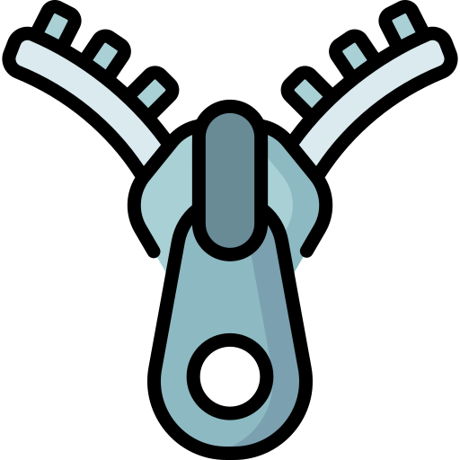

# My Python Portfolio

## A web app to showcase my Python projects

## <u>Table of Contents</u>

1. [About Me](#About-Me)
2. [Projects](#Projects)

## About Me

[View My Portfolio Here](https://charanvir-python-portfolio-home-gyb486.streamlit.app/)

Hi, my name is Charanvir Singh and I am a full stack developer. My primary programming language is JavaScript, but I
have always had an interest in Python. This portfolio is a place where I can showcase the projects that I have built,
with which I am learning the Python programming language. I hope to continue learning the language, and exciting
frameworks and libraries associated with Python. The projects will start to get more advanced as I learn the language
more, so stay tuned to see the cool projects and applications that I build.

This portfolio includes a functional Contact Me form, so if you have any tips on how to learn the language or cool
projects you would like to work on together, please feel free to visit my portfolio and contact me via the form.

Happy Coding!

## Projects

### Some projects included in my portfolio include:

### Todo List Web Application

Todo List Web Application is an easy-to-use application which allows users to manage tasks and items. Users can add new
items, modify existing items, and mark items as complete, effectively removing them from the todo list.

### File Extractor

File Extractor is a desktop application which allows users to select an archive file (zip file) and extract the contents
of the file. They choose the destination folder in which to save the file contained within the archive.

 

### PDF Generator

PDF Generator is a CLI application, which takes instructions from a .csv file and generates a PDF file. This file can
contain as many pages as the user wishes. This application contains two scripts, one for a blank pdf file, and one for
lined pages.

